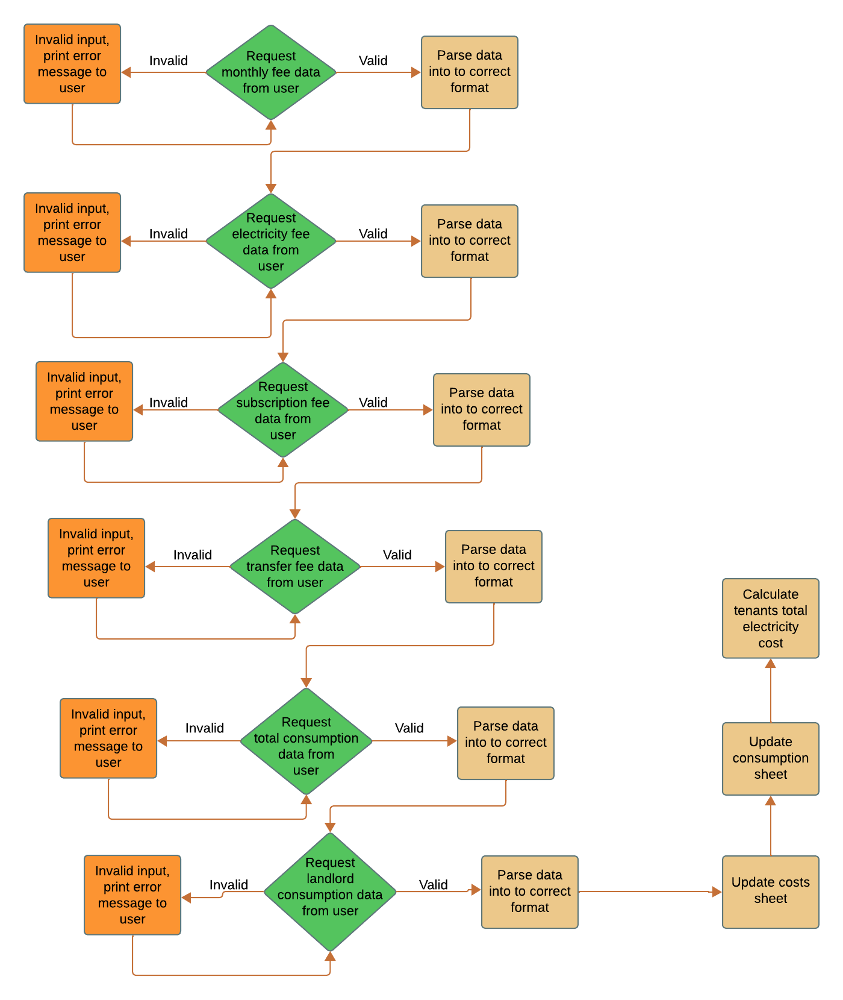

# Electricity data collection

## Table Of Contents

* [Introduction](#Introduction)
    * [Site Goals](#Site-Goals)
    * [Target Audience](#Target-Audience)
 * [Features](#Features)
	* [Planning](#Planning)
    * [Collect data](#Collect-data)

## Introduction

This data collection aims for landlords in Sweden to calculate what the tenant shall pay for the monthly electricity usage. The data collection is a mix of information from the electricity supplier and the landlord's electricity meter. The data is stored in a Google sheet and also provided directly in the terminal.

### Site goals

To provide a simple data collection to calculate the cost of electricity monthly usage.

### Target audience

Landlords with one electricity meter and a tenant who wants to charge them for their electricity usage.

## Features

### Planning

I used [Lucid.app](www.lucidchart.com) to plan the data collection.

Start

User entries

Calculations

#### Collect data from:

 - Invoice from the electricity supplier
	 - Monthly fee
	 - Electricity fee
	 - Subscription fee
	 - Transfer fee
	 - Total monthly usage

- Landlords monthly usage from meter

#### Update costs sheet

#### Update usage sheet

#### Calculate the tenant's usage

#### Calculate the tenant's monthly cost

### Future features 

If more tenants are added implement tenants name and list all data per tenant

[def]: docs/screenshots/lucidchart_start.png