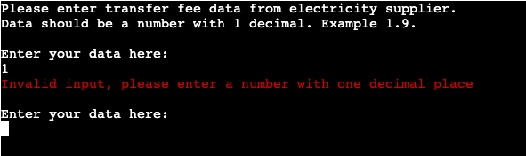
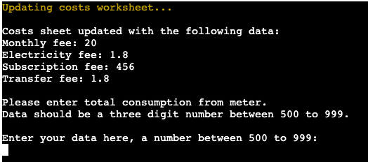
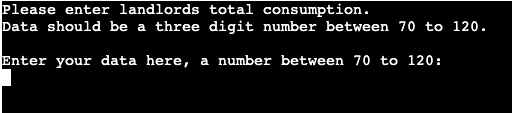

# Electricity data collection

## Table Of Contents

* [Introduction](#Introduction)
* [User demographic](#User-demographic)
	* [Site Goals](#Site-Goals)
    * [Target Audience](#Target-Audience)
* [Structure](#Structure)
	* [Planning](#Planning)
	* [Error handling](#Error-handling)
	* [Existing features](#Existing-features)
		* [API](#API)
		* [Data collection](#Data-collection)
		* [Calculation](#Calculation)
	* [Future features](#Future-features)
* [Testing](#Testing)
	* [Functional testing](#Functional-testing)
	* [Pep8 validation](#Pep8-validation)
* [Deployment](#Deployment)
	* [Github](#Github)
	* [Heroku](#Heroku)
* [Additional comments](#Additional-comments)
* [Credits](#Credits)

## Introduction

This data collection aims for landlords in Sweden to calculate what the tenant shall pay for the monthly electricity usage. The data collection is a mix of information from the electricity supplier and the landlord's electricity meter. The data is stored in a Google sheet and also provided directly in the terminal.

The live link to the app can be found here

And the google worksheet can be accessed through this link [Google sheet](https://docs.google.com/spreadsheets/d/1BEu4ZwBUQHSGmYAlvDbfmk11Y7h63C6sm_ugVHCv1jc/edit?usp=sharing)

## User demographic

### Site goals

To provide a simple data collection to calculate the cost of electricity monthly usage.

### Target audience

Landlords with one electricity meter and a tenant who wants to charge them for their electricity usage.

## Structure

### Planning

I used Lucidchart to plan the data collection.

#### Start

#### User entries

#### Calculations

### Error handling

Print messages were used throughout writing the code to ensure no errors occurred.

### Existing features

#### API

Google Sheets was used to store the data collection and was set up as below.

- At [Google Cloud](https://console.cloud.google.com/) Create a new project.

- Name the project.

- Select the project

- Go to APIs & Services and select library

- Search for Google Drive API, select it and press enable

- Then press create credentials

- Select as in the image below

- Then choose service role

- Next, click on the generated email address

- Add service key

- Choose json and create

- Go back to the library, search for Google Sheets API, and press enable.

I then uploaded the .json file to the IDE and renamed it creds. 

In the creds file, I copied the email address and shared my Google Sheets with that address.

#### Data collection

 - Below fees are retrieved from the invoice from the electricity supplier
	 - Monthly fee
	 - Electricity fee

	

	 - Subscription fee

	

	 - Transfer fee

	

	 - Update costs sheet
	 - Total monthly usage

	 

- Landlords monthly usage from meter

#### Calculation

- Update consumption sheet
- Calculate the tenant's usage
- Calculate the tenant's monthly cost

### Future features 

- If more tenants are added implement the tenant's name and show costs for each tenant separately. 
- A weekly debit instead of monthly for weekly tenants.

## Testing 

### Functional testing

All functions have been tested to ensure they work correctly and show valid user feedback.

### Pep8 validation

Validation was done according to [PEP8](https://pep8ci.herokuapp.com/#) rules. Most warnings were due to redundant whitespace or whitespace missing. And also redundant backslash and under-indentations. All of which are corrected.

### Unfixed Bugs

Nothing to note.

## Deployment

The app was created in Visual Studio Code editor desktop app. After some issues with the desktop app that could be linked to homebrew, I used Visual Studio Code in the browser.

### Github

The repository was created on GitHub.

### Heroku

The app was deployed on Heroku.

Even after running pip3 install -r requirements.txt some requirements were not added so an error message was shown when launching Heroku. The requirements for pyfiglet and colorama were added manually.

Configurations

## Additional comments

I had issues with the Visaul Studio Code desktop app. This was most likely due to the laptop's operating system being too old for all the requirements such as homebrew. This led me to have problems re-linking to github and when trying to set it up again I forgot to change my name when I copied the command line. So on commits from February 9th and 11th, commit looks to have been done by John Doe. I then used Visual Studio Code in the browser instead.

## Credits 
- The app is inspired by Love Sandwiches 
- [Tutorials point](https://www.tutorialspoint.com/how-do-i-call-a-variable-from-another-function-in-python) - How to make a variable global
- [Geegs for geeks](https://www.geeksforgeeks.org/python-ascii-art-using-pyfiglet-module/) - How to use pyfiglet for ASCII art
- [Scaler](https://www.scaler.com/topics/how-to-clear-screen-in-python/) - How to clear screen with os
- [Pypi](https://pypi.org/project/colorama/) - How to import colorama
- [Snyk Advisor](https://snyk.io/advisor/python/colorama/functions/colorama.Style.RESET_ALL) - How to use colorama
- [FreeCodeCamp](https://www.freecodecamp.org/news/the-python-sleep-function-how-to-make-python-wait-a-few-seconds-before-continuing-with-example-commands/#:~:text=You%20can%20use%20Python%27s%20sleep,time%20delay%20to%20your%20code) - How to use sleep function to show print message before clear function
- [Ask Python](https://www.askpython.com/python/string/decimal-formatting-0f-vs-1f) - How to show 2 decimals
- [Stack Overflow](https://stackoverflow.com/questions/6557553/get-month-name-from-number) - How to show the current month as string
- [Real Python](https://realpython.com/python-pep8/#maximum-line-length-and-line-breaking) - How to use line breaking
- Thanks to fellow student Ben Gilbert for additional testing of the app
- Thanks to my mentor Gareth McGirr